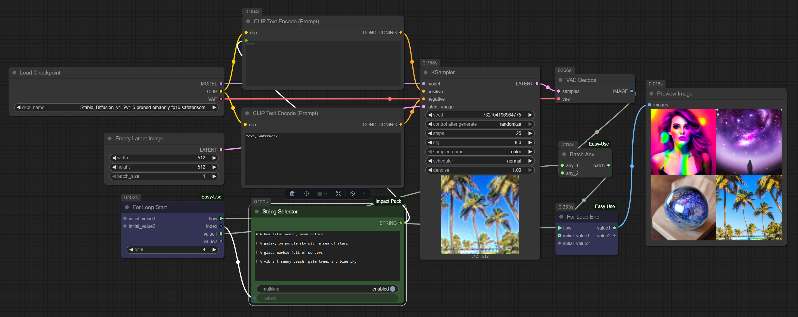

# Easy-Use For Loop Example (ComfyUI)

This repo contains a minimal ComfyUI workflow showing how to use the **Easy-Use For Loop** nodes to generate multiple images in one execution and collect them into a proper batch.

Here is link to the repository of the actual node pack: [https://github.com/yolain/ComfyUI-Easy-Use](https://github.com/yolain/ComfyUI-Easy-Use)

I found myself perplexed when looking at this for loop node, so I decided to learn about it in a plain test graph.

These nodes are very useful with video models when you need to make longer videos, or otherwise produce multiple things, combine bits of text, etc.

---

## 📌 Key Points

This is my understanding of it:

- **Loop state is explicit**
  - `ForLoopStart` exposes `value1/value2` sockets as *loop-carried variables*.
  - `ForLoopEnd` expects the updated state via `initial_value1/2` inputs.

- **Accumulator wiring**
  - `ForLoopStart.value1 > BatchAny.any_1 > ForLoopEnd.initial_value1`
  - This is the "batch handle" that gets carried across iterations.

- **`BatchAny` combines results**
  - Each pass appends the new decoded image to the carried batch.
  - After the final pass, `ForLoopEnd.value1` holds the full image batch.

- **Index-based variation**
  - `ForLoopStart.index` is used to pick a different text prompt per iteration.
  - In this example, the index is used with Impact-Pack String Selector to pick prompts.

- **Result**
  - One graph execution produces a proper ComfyUI batch (e.g., 4 images at once).

---

## 🖼️ Example Workflow

> The included `ComfyUI-Olm-Easy-Use-for-Loop-Example.json` demonstrates:
> - 4 iterations
> - Prompt variations driven by loop index
> - All results combined into one image batch
> - 3rd party nodes used (I tried to keep the dependencies minimal, but ther is no built-in node for selecting a sub-string/line AFAIK.)
>   - Easy-use [https://github.com/yolain/ComfyUI-Easy-Use](https://github.com/yolain/ComfyUI-Easy-Use)
>   - Impact-Pack [https://github.com/ltdrdata/ComfyUI-Impact-Pack](https://github.com/ltdrdata/ComfyUI-Impact-Pack)

---

## 🚀 Usage

1. Open `ComfyUI-Olm-Easy-Use-for-Loop-Example.json` in your ComfyUI.
2. You might need to install the missing nodes.
3. Select the model as it's most likely not found (Stable Diffusion 1.5).
4. Run the graph and you will get 4 images batched together.
5. Edit the prompts, iteration count, or accumulator logic to experiment further.

I hope this helps, add a star if it did!

---

## 🙌 Notes

- Only the **accumulator state** (`value1/2`) should be wired through the loop.
- Model, VAE, and static settings stay outside the loop.
- I reformatted the ComfYUI graph JSON to be more human-readable.

---

## 📂 Files

- `ComfyUI-Olm-Easy-Use-for-Loop-Example.json` - the demo workflow.
- `README.md` - this file.
- `ComfyUI-Olm-Easy-Use-for-Loop-Example_Image.png` - workflow screenshot.

---

### License

MIT